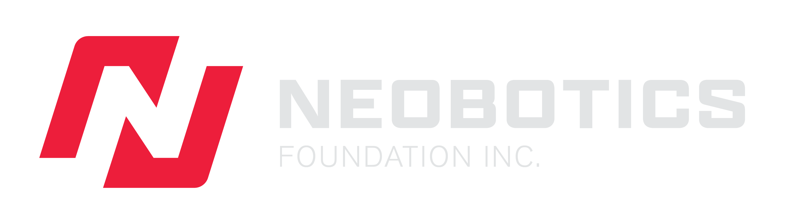
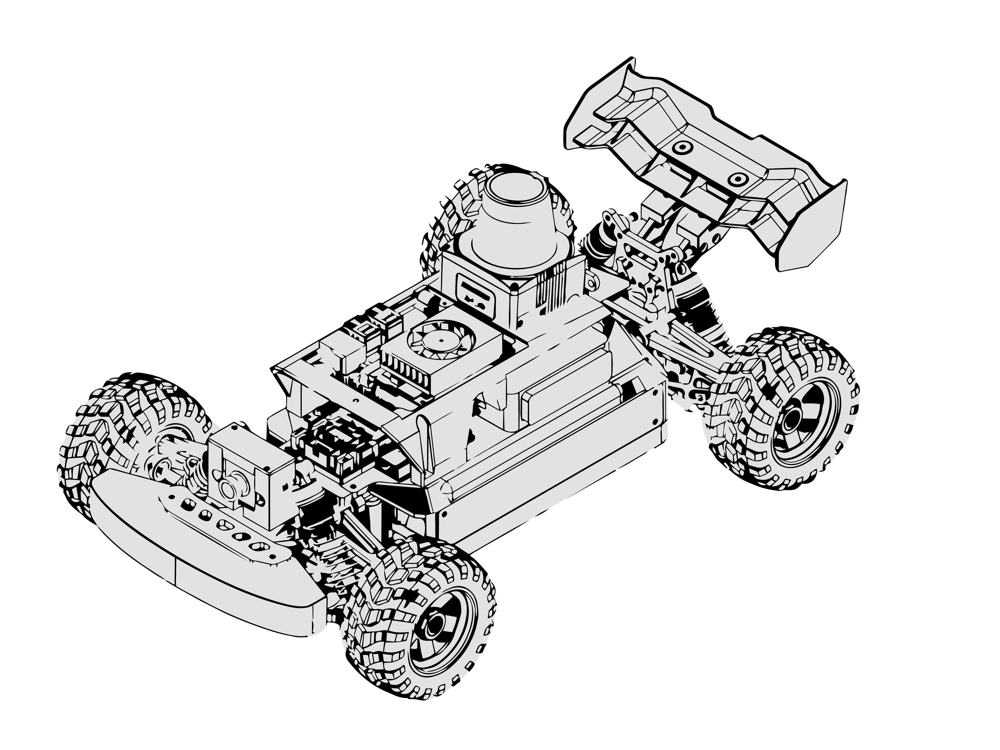

Empowering the next generation of robotics education

 

# Welcome to Neobotics

Welcome! Our GitHub organization is the home to all projects and repositories associated with **Neobotics Foundation Inc.**, along with the broader community discussions and support.

Our goal is to build a **practical, well-documented, and accessible racecar** that is easy to use, easy to contribute to, and an educational tool for students and researchers alike.

Whether you’re here to **use our software**, **learn from it**, or **contribute**, you’re in the right place!

## 🏎️ NeoRacer V1

The **NeoRacer** is designed to be both a benchmark platform for autonomous vehicle research and a flagship system for self-driving education. 

It faithfully replicates real-world road scenarios at scale, enabling students and researchers to understand, test, and validate the full autonomous driving stack, from perception and planning to control and deployment. 

### Specifications

| Category | Specification | Value |
|----------|---------------|-------|
| **Chassis** | Dimensions | 380 x 300 x 220mm |
| | Wheelbase | 280mm |
| | Drive System | Single Motor 4WD shaft drivetrain |
| | Frame | Independent suspension, Ackermann steering |
| | Max Speed | 25 km/hr |
| **Power** | Battery | 11.1V LiPo, 5200mAh |
| | Motor | Custom brushed motor, 11000 RPM |
| | Servo | 20kg waterproof High-Torque |
| **Compute** | Processor | NVIDIA Jetson Orin Nano |
| | OS | JetPack 6.2 pre-installed |
| | Framework | ROS (Robot Operating System) ready |
| **Sensors** | LiDAR | Industrial-grade 30 Hz 2D |
| | Camera | High-resolution for image capture |
| | IMU | 9-axis (accelerometer, magnetometer, gyroscope) |
| | Encoder | Incremental A/B/Z 3-channel |

By bridging education and experimentation, NeoRacer serves as a practical testbed for investigating and addressing many of the open challenges that continue to define autonomous vehicle research today.

---

## 🗂️ Ecosystem

Explore the repositories that power the NeoRacer platform:

| Repository | Language | License | Issues | Contributors | Activity |
|------------|:--------:|:-------:|:------:|:------------:|:--------:|
| [**neoracer_ros2_driver**](https://github.com/Neobotics-Foundation-Inc/neoracer_ros2_driver) Backend ROS2 driver for neoracer v1 with... |  |  |  |  |  |
| [**NeoRacer-V2**](https://github.com/Neobotics-Foundation-Inc/NeoRacer-V2) 3D-printable open-source chassis for aut... |  |  |  |  |  |
| [**support**](https://github.com/Neobotics-Foundation-Inc/support) Documentation, discussions, extended res... |  |  |  |  |  |

---

## 📖 How to Use This Github

### If you just want to use the projects
1. Browse the repositories in this organization
2. Read the `README.md` in each repo for setup and usage instructions
3. Clone or fork the repository as needed
4. Follow the [license terms](#licensing)

### If you want to ask questions or discuss ideas
Use **[GitHub Discussions](https://github.com/orgs/Neobotics-Foundation-Inc/discussions)** for:
- General questions
- Design discussions
- Feature ideas
- Community feedback

Use **GitHub Issues** for:
- Bug reports
- Clearly defined feature requests
- Reproducible technical problems

### If you want to contribute
We welcome contributions of all kinds: code, documentation, examples, tests, or suggestions.

1. Start by reading the `CONTRIBUTING.md` file in the repository if available
2. Familiarize yourself with the repository's issues
3. Fork the repository and create a feature branch
4. Make small, focused changes
5. Open a pull request with a clear explanation of what you changed and why

If you’re unsure where to start, feel free to open a discussion first.

---

## 🌍 Community Guidelines

We aim to keep this space:
- Respectful and welcoming
- Technically constructive
- Focused on learning and collaboration

Please be kind, assume good intent, and help us maintain a positive and productive community.

---

## ♥️ Support Neobotics

There are many ways to help the Neobotics community grow:

- **Star our repositories** — It helps others discover our work and shows your support. Every star makes a difference!
- **Spread the word** — Share our projects with fellow students, educators, and robotics enthusiasts.
- **Donate** — As a nonprofit organization, we rely on community support to continue building accessible robotics education tools. Your contribution helps us develop new platforms, create educational content, and keep our projects open-source.

---

## 📃 Licensing

All projects in this organization are open-source, but **licenses may vary by repository**.  
Always check the `LICENSE` file in each repository before using or redistributing the work.

In general:
- **Software repositories** are typically licensed under **GNU GENERAL PUBLIC LICENSE Version 3 ([GPLv3](https://www.gnu.org/licenses/gpl-3.0.en.html))**
- **Hardware and open-hardware repositories** are typically licensed under **CERN Open Hardware Licence Version 2 - Strongly Reciprocal ([CERN-OHL-S](https://cern-ohl.web.cern.ch))**

The exact license and its terms are defined in each repository and take precedence over this general guidance.

We’re excited to build this community together, welcome aboard :)
